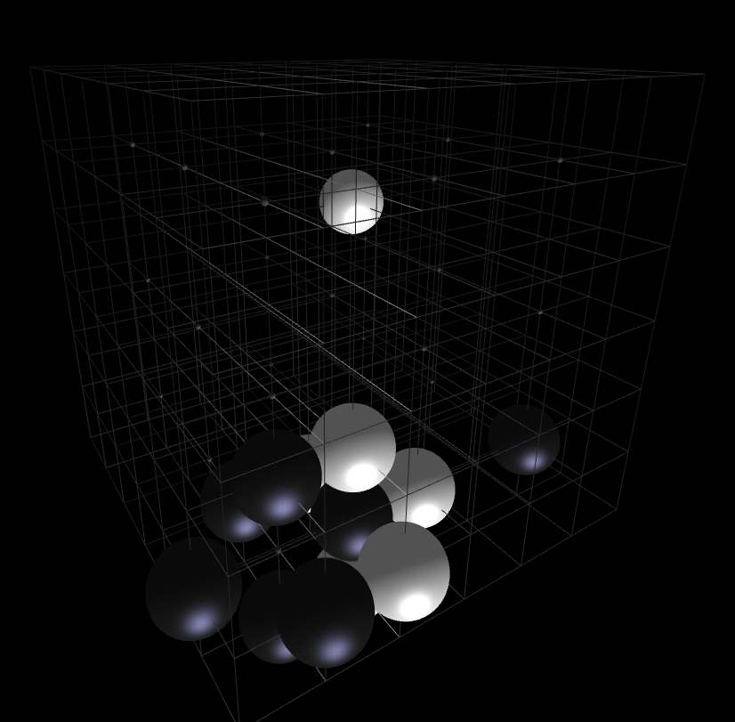
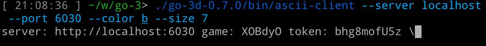
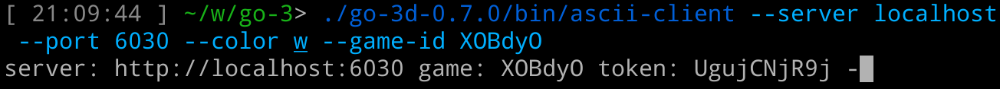
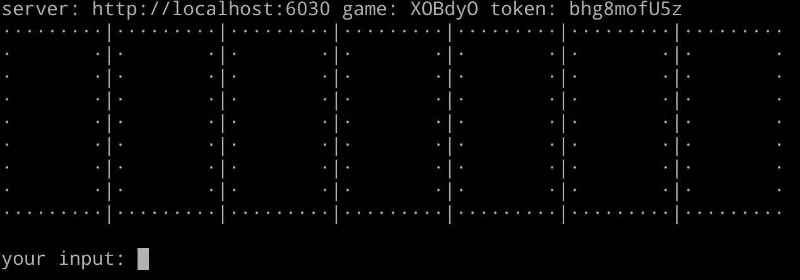
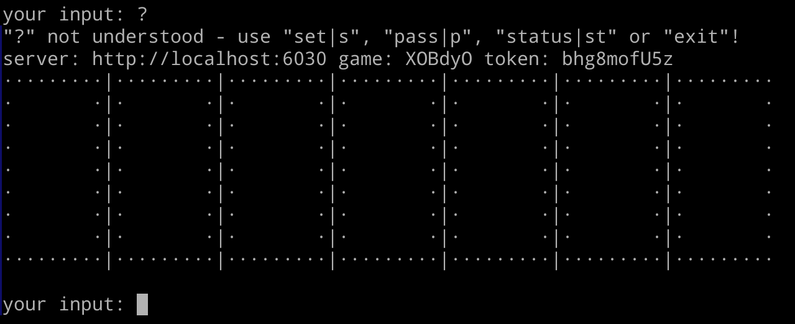
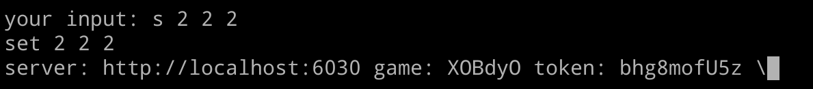
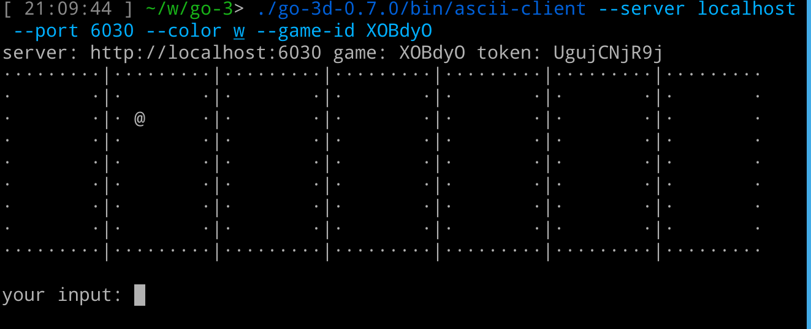
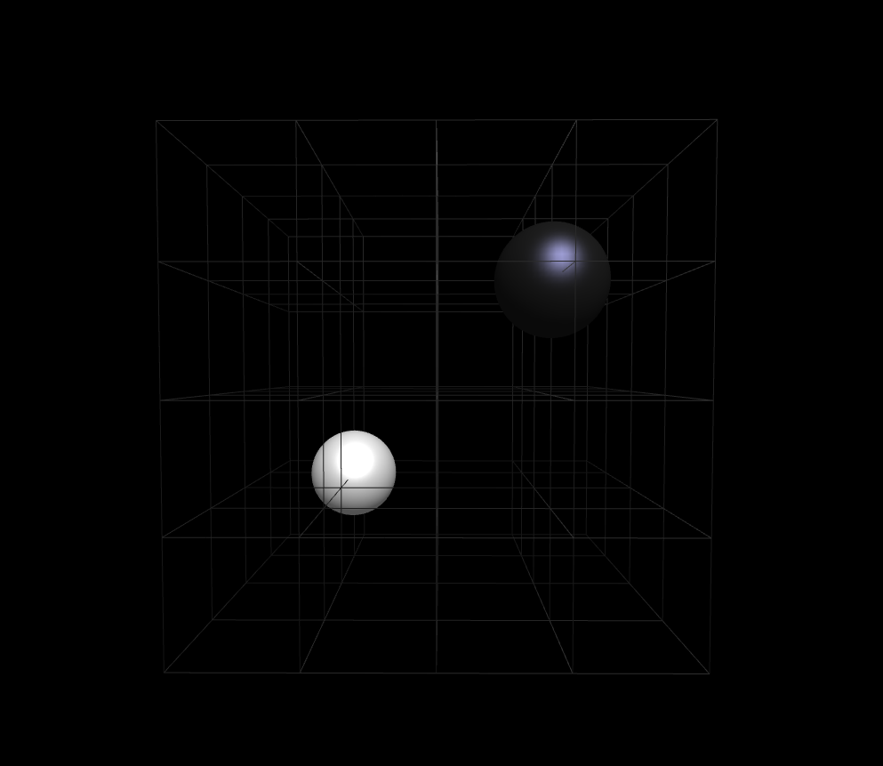

The Asian game of Go (its Japanese name; also known as Weiqi in Chinese and Baduk in Korean) takes 
place on a two-dimensional board. Its idea readily extends to three dimensions - placing stones on a
cubic lattice. 



This is a program for playing on such a three-dimensional lattice. 

# Installing

To play three-dimensional Go you need one server and a client for each player. You can either run 
them from a docker image (the recommended way at this time) or build them with `sbt` and run them
locally.

## Docker image

Using the docker image no local installation is needed. It is necessary that you have `docker` 
installed locally and the `docker` daemon is running. See https://www.docker.com/get-started/ to get
started with `docker`.
 
## Building from source

It is assumed you have Scala and the `sbt` Scala Build Tool installed. See 
[Installing `sbt`](#markdown-header-installing-sbt) below for minimalistic install instructions for 
`sbt`.

### Clone the repository from GitHub
```shell
$ git clone https://github.com/lene/go-3.git
```
`cd go-3` to continue.

### Build with `sbt`
```shell
$ sbt universal:packageBin
```
This creates the archive `target/universal/go-3d-$VERSION.zip`, where `$VERSION` is the version of 
3D Go you are trying to install. If you unzip this archive to folder `$TARGET`, it will create the 
folders `$TARGET/go-3d-$VERSION/bin` and `$TARGET/go-3d-$VERSION/lib`. When referring to commands in 
the following, it is assumed that `$TARGET/go-3d-$VERSION/bin` is in your `$PATH` - otherwise, 
prepend `$TARGET/go-3d-$VERSION/bin` to the commands given below.

# Running

## Server

Set `$SAVE_DIR` to the folder to save games in and `$PORT` to the port the server runs on.

### From docker image
```
$ docker run [--net=host] [--env SAVE_DIR=$SAVE_DIR] [--env PORT=$PORT] \
    -t registry.gitlab.com/go-3/go-3/server:latest
```
Depending on your Docker configuration, the `--net=host` may be necessary or not.

### From a local install
``` 
$ go-server [--port $PORT] [--save-dir $SAVE_DIR]
```

## Client

### Docker
For the client, no convenient Docker image exists yet. If you do not want to perform the local 
installation, I suggest you run the docker image in interactive mode:
```shell
$ docker run --net=host --env PORT=$PORT --entrypoint /bin/bash -it \
         -t registry.gitlab.com/lilacashes/go-3/server:latest
```
You will be dropped into a `bash` shell. From there you can add `/go-3/bin` to the `PATH` 
environment variable:
```shell
$ export PATH=/go-3/bin:$PATH
```
and continue as with a local install, as detailed below.

### Local install

#### Connecting two players to start a game
To start a new game with board size `$SIZE`:
```
$ ascii-client --server $SERVER --port 6030 --size $SIZE --color [b|w]
```
This will print a status line with a Game ID and a token:



You will need to remember the Game ID for another player to join the game. Remember the token if you
might close down your client and want to reconnect to the same game later on.

To register as second player for a game with ID `$GAME_ID`:
```
$ ascii-client --server $SERVER --port 6030 --game-id $GAME_ID --color [b|w]
```
This will print a similar line in the just started second line:



#### Making moves
Meanwhile the first client will now show an ASCII representation of an empty 3D Go board, as 
`$SIZE` 2D board laid out next to each other:



Once a client is ready to make a move, the command `s $X $Y $Z` will set a stone at position
(`$X`, `$Y`, `$Z`), or the command `p` will pass.

To get help, enter any unrecognizable command:



Once you have set, your client will wait for the opponent to respond:



While the other client will now display the updated board with the last set stone, and ask player 
White to make their move:



This will continue until either both players pass or the number of possible moves is exceeded, at 
which point the client will display each player's score and exit.

#### 3D display of a game
Admittedly the board display in the ASCII client is not very intuitive. Since version 0.7.0 there is
a client providing a three-dimensional display of the board. This client can only watch boards at 
the moment, not make any moves, so it can be used in conjunction with the ASCII client. To start it, 
type:
```shell
$ gdx-client --server $SERVER --port 6030 --game-id $GAME_ID
```
to get a freely rotatable and zoomable representation of the board akin to this:



#### Reconnecting after a dropped connection
To reconnect to a game that has already started and the player has been given the authentication
token `$TOKEN`:
```
$ ascii-client --server $SERVER --port 6030 --game-id $GAME_ID --token $TOKEN
```
The client will display a spinning prompt while waiting for the other client to make their move.

#### Bot client
A client with a number of predefined strategies is available. To use it, run:
```shell
$ bot-client --server $SERVER --port 6030 \
            [--size $SIZE --color b|w ] | \ 
            [--game-id $GAME_ID --color b|w] |\
            [--game-id $GAME_ID --token $TOKEN] 
            --strategy $STRATEGY [--max-thinking-time-ms $MILLISECONDS]
```
where `$STRATEGY` currently can be any, or any combination, of:
* `random`: set stones at random (an awful strategy!)
* `closestToCenter`: set as close to the center as possible
* `onStarPoints` : try to set on the star points first. If all are occupied, try the next strategy.
* `closestToStarPoints`: try to set as close to star points as possible
* `maximizeOwnLiberties`: have as many liberties (counted over all stones) as possible with every 
  move
* `minimizeOpponentLiberties`: take away the opponent's liberties (counted over all opponent's 
  stones)
* `maximizeDistance`: set stones as far away as possible from others
* `prioritiseCapture`: try to capture opponent stones, setting a stone next to an opponent's stone 
  with the fewest liberties

and `$MILLISECONDS` is the approximate(!) maximum time in milliseconds the bot will take to
make a move. The time is limited by randomly choosing a selection from all possible moves, and 
executing the strategy on those. The default is not to limit the thinking time.

If you combine multiple strategies (by giving a comma separated list as input to `--strategy`), the
strategies are evaluated one after the other, the next strategy executed on the moves that are 
equally optimal according to the previous strategy. For example, 
`--strategy prioritiseCapture,closestToCenter,maximizeOwnLiberties` will try to minimize the 
liberties of an opponent's stone. If there are multiple stones with an equal number of liberties, it
will choose among those which are closest to the center ("on the inside"). And if multiple of those 
remain, it will prefer those positions that give itself more liberties.

# Development notes

## Installing `sbt`

See https://www.scala-sbt.org/1.x/docs/Installing-sbt-on-Linux.html for full instructions.

### Shortcut for Ubuntu
```shell
echo "deb https://repo.scala-sbt.org/scalasbt/debian all main" | sudo tee /etc/apt/sources.list.d/sbt.list
echo "deb https://repo.scala-sbt.org/scalasbt/debian /" | sudo tee /etc/apt/sources.list.d/sbt_old.list
curl -sL "https://keyserver.ubuntu.com/pks/lookup?op=get&search=0x2EE0EA64E40A89B84B2DF73499E82A75642AC823" | sudo apt-key add
sudo apt-get update
sudo apt-get install sbt
```

### Troubleshooting

```shell
$ sbt compile
...
[error] java.io.IOException: User limit of inotify instances reached or too many open files
...
```
can be solved with:
```shell
$ cat /proc/sys/fs/inotify/max_user_instances
128
$ echo 256 | sudo tee /proc/sys/fs/inotify/max_user_instances
256
```
or for a longer term solution (?)
```shell
$ sudo sysctl fs.inotify.max_user_instances=256
```
